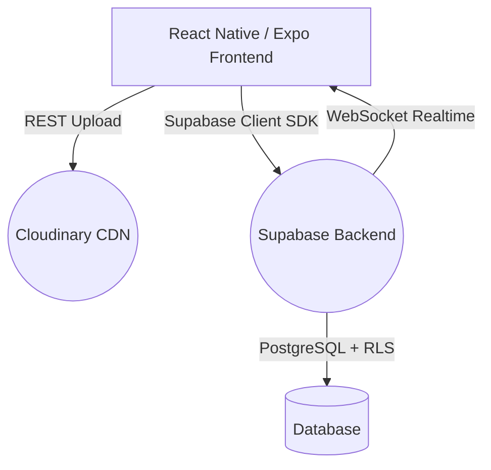
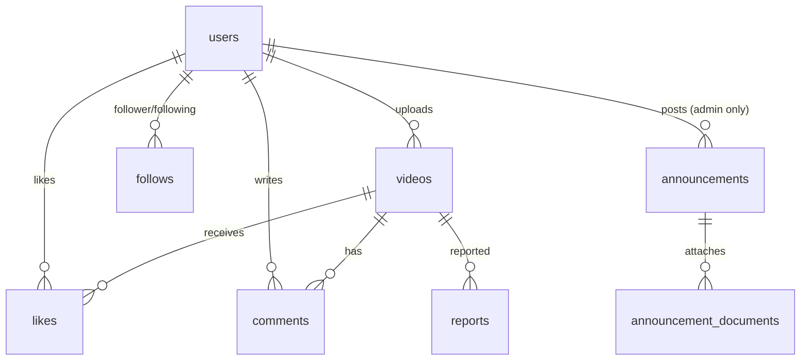

<div align="center">


# U-Buzz 🐝

### *Your Campus. Your Buzz.*

**IUGET's exclusive campus short-video social platform** — think TikTok, but private, data-conscious, and built for the student body of *Institut Universitaire des Grandes Ecoles des Tropiques*, Douala 🇨🇲

[](https://reactnative.dev/)
[](https://expo.dev/)
[](https://supabase.com/)
[](https://www.typescriptlang.org/)
[](https://cloudinary.com/)

</div>

---

## 🎯 Why U-Buzz?

Global platforms like TikTok and Instagram leave campus communities invisible. U-Buzz fixes that with **three hard constraints**:

| Problem | U-Buzz's Solution |
|---|---|
| 🌐 Global algorithms drown local voices | Campus-only feed — IUGET content only |
| 📱 Mobile data is expensive in Cameroon | Cloudinary-powered 1 Mbps / 720p cap saves data |
| 🔐 No student ID verification API at IUGET | Honor-system matricule format (`IU2024`) + privacy masking (`IU****24`) |
| 📢 Admin notices get buried in the feed | Dedicated admin announcements channel with PDF attachments |

---

## ✨ Features

<table>
<tr>
<td width="50%">

### 📱 Core Experience
- **Vertical Video Feed** — TikTok-style full-screen scroll with "For You" and "Following" tabs
- **Double-tap to Like** — Heart burst animation at touch point
- **Real-time Comments** — Supabase Realtime WebSocket sync across all devices
- **Video Upload** — Direct multipart upload to Cloudinary (max 30MB / 60s)

</td>
<td width="50%">

### 🔒 Campus Safety
- **Matricule Validation** — Regex-enforced `^IU[0-9]{4,}$` format on client + DB
- **Privacy Masking** — Matricules displayed as `IU****45` in search results
- **Admin Channel** — RLS-protected announcements only admins can post
- **Report System** — Admin-accessible report queue for abusive content

</td>
</tr>
<tr>
<td width="50%">

### 👤 Social Graph
- **Follow / Unfollow** — Curated following feed
- **Profile Grid** — 3-column 9:16 thumbnail gallery
- **Edit Profile** — Avatar upload via Cloudinary with face-crop
- **Badge Notifications** — Unread announcement red dot

</td>
<td width="50%">

### ⚡ Performance
- **FlatList Tuning** — `windowSize={3}`, `removeClippedSubviews`, `getItemLayout`
- **On-the-fly Transcoding** — `f_auto,q_auto,br_1m,w_720` Cloudinary params
- **Skeleton Loaders** — Pulsing gradient placeholders
- **ChunkedSecureStore** — Splits JWT tokens exceeding Android's 2KB limit

</td>
</tr>
</table>

---

## 🛠 Tech Stack



| Layer | Technology |
|---|---|
| **Mobile App** | React Native 0.81 + Expo 54 (Managed Workflow) |
| **Language** | TypeScript 5.9 |
| **Navigation** | React Navigation v7 (Stack + Bottom Tabs) |
| **Backend / Auth** | Supabase (PostgreSQL, Auth, Realtime) |
| **Media CDN** | Cloudinary (unsigned uploads, on-the-fly transformations) |
| **Styling** | NativeWind (Tailwind CSS for React Native) |
| **Video Player** | `expo-video` (AVPlayer on iOS, ExoPlayer on Android) |
| **Secure Storage** | `expo-secure-store` + custom `ChunkedSecureStoreAdapter` |
| **Animations** | `react-native-reanimated` + `react-native-gesture-handler` |

---

## 🗃 Database Schema



### Key Design Decisions
- **`is_admin` flag** on `users` table controls announcement CRUD via RLS policies
- **`handle_new_user()` trigger** auto-creates a public profile on every Supabase Auth signup
- **Unique matricule constraint** enforces one-account-per-student at the DB level
- **Cloudinary `public_id`** stored alongside `secure_url` for future deletion/management

---

## 🚀 Getting Started

### Prerequisites
- Node.js 18+
- Expo CLI (`npm install -g expo-cli`)
- A [Supabase](https://supabase.com) project
- A [Cloudinary](https://cloudinary.com) account with an unsigned upload preset

### 1. Clone the repo
```bash
git clone https://github.com/daikictrl/uBuzz.git
cd uBuzz
```

### 2. Install dependencies
```bash
cd frontend
npm install
```

### 3. Configure environment variables
Copy the example env file and fill in your credentials:
```bash
cp .env.example .env
```

```env
EXPO_PUBLIC_SUPABASE_URL=https://your-project.supabase.co
EXPO_PUBLIC_SUPABASE_ANON_KEY=your-supabase-anon-key
EXPO_PUBLIC_CLOUD_NAME=your-cloudinary-cloud-name
EXPO_PUBLIC_PRESET_NAME=your-unsigned-upload-preset
```

### 4. Apply database migrations
Run the SQL files in `/backend/migrations/` in order against your Supabase project:
```
001_create_tables.sql
004_user_trigger.sql
006_announcements.sql
007_announcement_document.sql
```

### 5. Run the app
```bash
npx expo start
```
Scan the QR code with **Expo Go** on your device, or press `a` for Android emulator / `i` for iOS simulator.

---

## 📂 Project Structure

```
uBuzz/
├── frontend/                  # React Native (Expo) application
│   ├── src/
│   │   ├── components/        # Reusable UI components
│   │   │   ├── CommentsSheet.tsx
│   │   │   ├── EditProfileSheet.tsx
│   │   │   ├── SkeletonCard.tsx
│   │   │   └── VideoCard.tsx
│   │   ├── screens/           # Full screens
│   │   │   ├── AuthScreen.tsx
│   │   │   ├── HomeScreen.tsx
│   │   │   ├── UploadScreen.tsx
│   │   │   ├── ProfileScreen.tsx
│   │   │   ├── AnnouncementsScreen.tsx
│   │   │   └── AdminDashboardScreen.tsx
│   │   ├── navigation/        # React Navigation setup
│   │   ├── lib/               # Utilities (validation, badges)
│   │   └── services/          # Cloudinary upload services
│   └── assets/                # App icons & splash screen
├── backend/
│   └── migrations/            # PostgreSQL migration files
└── context/                   # Architecture & code standards docs
```

---

## 📈 Development Progress

| Phase | Feature | Status |
|---|---|---|
| 1 | Project Scaffold + Supabase Setup + Auth Screen | ✅ Done |
| 2 | Home Feed — Vertical Video Scroll | ✅ Done |
| 3 | Upload Screen + Cloudinary Pipeline | ✅ Done |
| 4 | Comments Bottom Sheet + Realtime Sync | ✅ Done |
| 5 | Profile Screen + Edit Profile | ✅ Done |
| 6 | Follows System + Feed Filter | ✅ Done |
| 7 | Admin Dashboard + Announcements Channel | ✅ Done |
| 8 | Polish + Production Hardening | 🚧 In Progress |

---

## 🎨 Design System

U-Buzz uses a **dark-first glassmorphism** design language:

| Token | Value | Usage |
|---|---|---|
| Background | `#0A0A0F` | App base |
| Surface | `#16161E` | Cards, bottom sheets |
| Primary Purple | `#8B5CF6` | CTAs, upload button |
| Secondary Pink | `#EC4899` | Likes, hearts, notifications |
| Trust Blue | `#3B82F6` | Verified badges, links |
| Glass Highlight | `rgba(255,255,255,0.08)` | Card borders |

---

## 🔒 Security Notes

- The Supabase **anon key** is intentionally public-facing (designed for client-side use)
- All sensitive write operations are protected by **Row Level Security (RLS)** policies
- Announcement creation and deletion are **admin-only** via RLS
- The `.env` and `eas.json` files are excluded from this repository — **never commit them**
- Matricule numbers are **masked in search results** (`IU****45`) to protect student privacy

---

## 📝 License

This project is for educational and campus use at **IUGET, Douala, Cameroon**.

---

<div align="center">

Made with 🐝 for IUGET students · Powered by [Supabase](https://supabase.com) & [Cloudinary](https://cloudinary.com)

</div>
