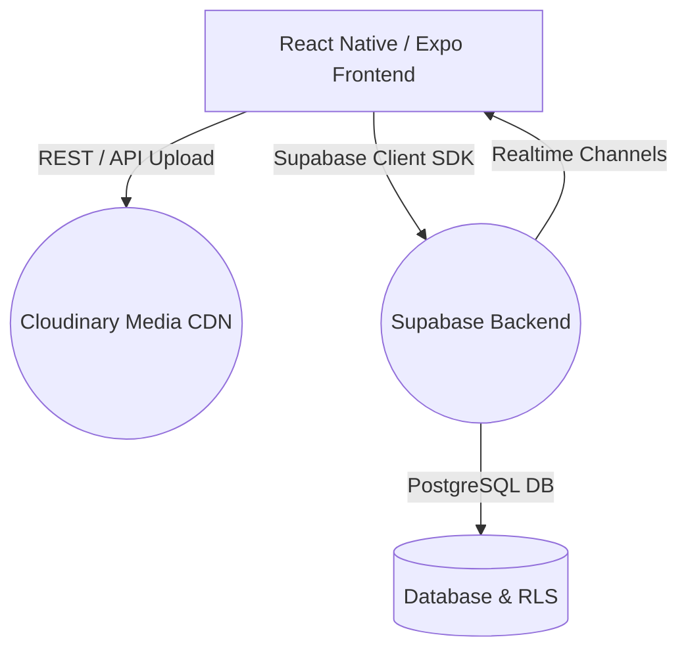
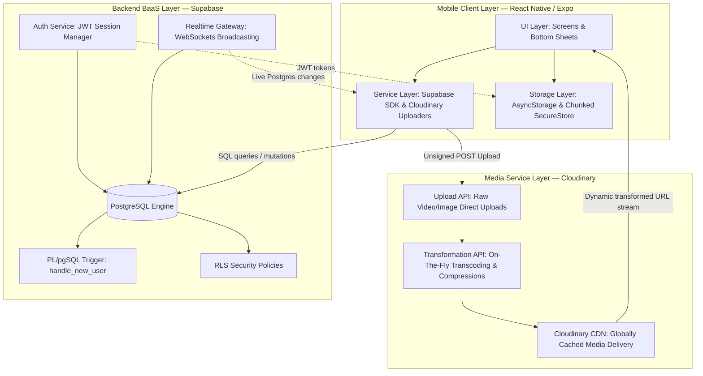
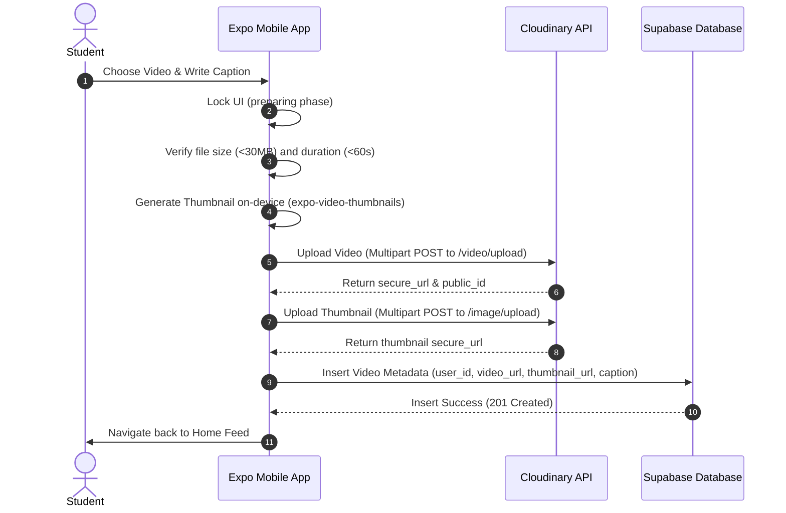
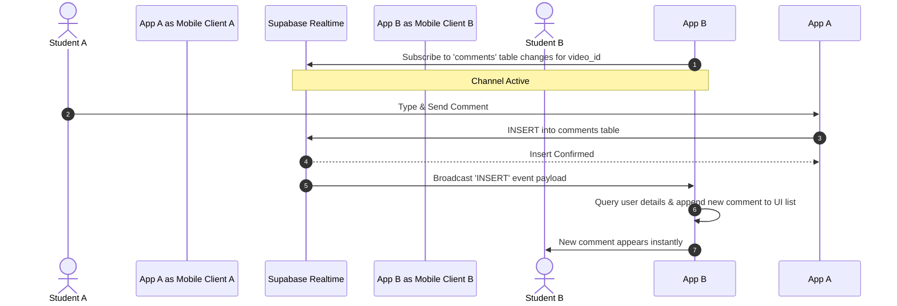
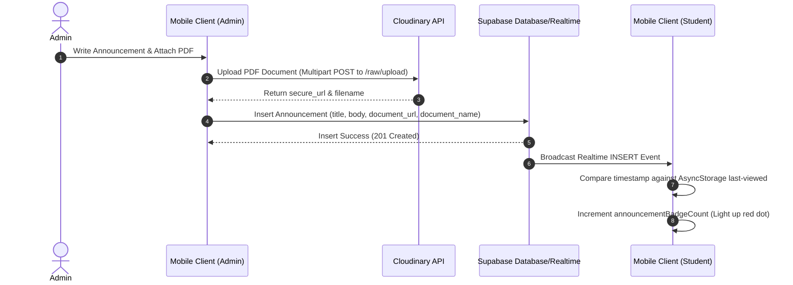
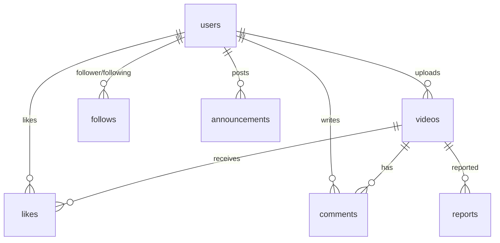

# U-Buzz — Comprehensive Project Details Document

U-Buzz is a campus-exclusive, short-video social platform modeled after TikTok and Instagram Reels, tailored specifically for the student body of **IUGET (Institut Universitaire des Grandes Ecoles des Tropiques)**, Douala, Cameroon.

---

## 1. Real-Life Issues Addressed

U-Buzz was designed to solve several campus-specific and regional problems:

### A. The Hyper-Local Communication Gap
Traditional social media platforms (TikTok, Instagram, Snapchat) are global and algorithmically geared toward massive audiences. This makes it difficult for students on a single campus to share local announcements, showcase student life, and build peer relationships. U-Buzz restricts content entirely to the local IUGET campus.

### B. High Bandwidth & Mobile Data Costs (Cameroon Context)
In Cameroon, mobile internet data is expensive. Streaming raw high-definition video feeds would deplete student data packages instantly. U-Buzz addresses this by integrating a strict **media optimization pipeline** using **Cloudinary**, enforcing low bitrates (capped at 1 Mbps), resolution limits (720p), and device-compatible dynamic transcoding.

### C. Trust & Identity Without Official Academic API Integration
IUGET has no public database/API for verifying student identities. U-Buzz implements a self-verifying, honor-system validation:
* SignUp requires a matricule format strictly validated on both client and database levels via the regex constraint: `^IU[0-9]{4,}$` (e.g. `IU2024`, `IU10045`).
* A database uniqueness constraint enforces a *one-matricule-per-account* policy.
* Privacy filters mask matricules in search results (e.g., displaying `IU****45` instead of `IU123445`) to protect student identities.

### D. Official Campus Communications
To prevent administrative announcements from getting lost in a general feed of short videos, U-Buzz introduces a structured, admin-only announcements channel. This allows the school administration (using pre-configured credentials, bypassing standard matricule registrations) to publish highlights and official notices directly to students in a dedicated feed.

---

## 2. Core Tech Stack

### Frontend (Mobile App)
* **Framework**: [React Native](https://reactnative.dev/) with [Expo](https://expo.dev/) (Managed Workflow)
* **Programming Language**: TypeScript
* **Video Playback Engine**: `expo-video` (highly optimized and native-backed video player)
* **Document Picker**: `expo-document-picker` (allows admins to select PDF and text attachments)
* **Local Storage**: `AsyncStorage` (used for global mute toggles, rate limiting, tab badge view timestamps, and temporary state)
* **Secure Storage**: `expo-secure-store` with a custom **ChunkedSecureStoreAdapter** to split JWT payloads exceeding Android's 2048-byte limit.
* **Styling**: NativeWind (Tailwind CSS) + Vanilla CSS

### Backend & Infrastructure (Serverless)
* **Backend as a Service (BaaS)**: [Supabase](https://supabase.com/)
  * **Database**: PostgreSQL (relational storage with schema rules, indexes, and triggers)
  * **Authentication**: Supabase Auth (email-based login/signup with custom session persistence)
  * **Realtime Services**: Supabase Realtime (Postgres Changes subscription for live comments and notifications)
* **Media CDN & Optimization**: [Cloudinary](https://cloudinary.com/) (unsigned direct multipart uploads, dynamic transformations, and globally distributed CDN caches)

---

## 3. Detailed System Architecture

U-Buzz is designed around a decoupled, serverless client-service architecture. The React Native mobile client handles the presentation, local state, and direct media streaming, while Supabase provides transactional database operations, user authentication, and realtime websocket synchronization, and Cloudinary acts as the serverless media optimization and storage pipeline.

### Architectural Blueprint

### Architectural Components

#### A. Mobile Presentation Layer (Client)
* **View Layer (React Native / Expo)**: Renders standard pages (`HomeScreen` feed, profile grid, comments sheets). Views are lightweight and depend on layout components and validation scripts.
* **Service Integrations**: Utilizes the Supabase JS client for authentication and database queries, and a custom direct-to-Cloudinary upload agent for media assets.
* **Secure Storage Layer**: Uses standard `AsyncStorage` for global settings and persistent state, and `expo-secure-store` wrapped in a custom partition adapter (`ChunkedSecureStoreAdapter`) to chunk session tokens larger than 2KB on Android devices.

#### B. Database & Auth Backend Layer (Supabase)
* **Auth System**: Direct user login, registration, and email OTP flows.
* **PostgreSQL Engine**: Handles relational integrity. Runs a registration trigger (`handle_new_user()`) and enforces schema controls. Tracks administrative roles using an `is_admin` attribute in the user profile.
* **Row-Level Security (RLS)**: Enforces security directly in PostgreSQL. Any SQL query issued from the client is validated by evaluating the requester's JWT. RLS restricts announcement creation and deletion exclusively to authenticated admin profiles.
* **Realtime Gateway**: Uses PostgreSQL replication channels to broadcast mutations (such as new comments) to listening mobile clients over WebSockets.

#### C. Optimized Media CDN Layer (Cloudinary)
* **Unsigned Upload Endpoint**: Bypasses the need for a backend proxy. The mobile client sends media directly to Cloudinary using secure, restricted configuration profiles.
* **Transformation Engine**: Transcodes and optimizes media assets on-the-fly when requested by the mobile client, reducing bandwidth usage.

---

## 4. Communication Flows & Data Pipelines

### A. Video Upload Pipeline
When a user selects a video to post, the media flows through a multi-step upload pipeline:

---

### B. Realtime Comment Synchronisation
Comments are synchronized instantly using Supabase's Realtime Postgres Changes listener:

---

### C. Realtime Announcement & Document Flow
When the school administration publishes a campus notice, it is broadcast to all students in real time:

---

## 5. Database Schema & RLS Model

The database is built on PostgreSQL, utilizing Row Level Security (RLS) policies to protect student data.

### Table Structure
1. **`users`**: Public profiles of students. Enforces unique matricules and emails. Contains `is_admin` boolean flag (defaults to `false`).
2. **`videos`**: Metadata of uploaded videos. Stores Cloudinary `secure_url` and `cloudinary_public_id`.
3. **`likes`**: Relational join table mapping users to videos they liked. Enforces unique combinations to prevent double-likes.
4. **`comments`**: Stores the text bodies of comments linked to a user and a video.
5. **`follows`**: Self-referencing join table mapping `follower_id` to `following_id`.
6. **`reports`**: Stores reports on abusive profiles or videos (accessible only by administrators).
7. **`announcements`**: Stores administrative highlights and notices. Contains title, body, optional image URL, optional raw document URL, and document name. Protected by RLS (insert/delete restricted to admin profiles).

### Database Trigger: `handle_new_user`
On SignUp, Supabase Auth inserts a row into its internal `auth.users` table. A custom database trigger is automatically executed:
* Creates a matching public user record in `public.users`.
* Resolves missing/invalid matricules by auto-generating a unique valid matricule.
* Formats and formats usernames, ensuring no duplicate accounts exist.

---

## 6. Performance & Media Optimisation Strategy

To ensure a smooth TikTok-style feed without buffering lag, the project implements strict optimizations:

### A. Cloudinary On-The-Fly Transformations
All URLs retrieved from the database are transformed in real-time before being loaded into image/video containers:
* **Videos**: Parameters `f_auto,q_auto,br_1m,w_720` are appended. This transcodes the format based on the client device (e.g., WebM for Android, HEVC/MP4 for iOS), drops video quality to a compressed target, caps the bandwidth to **1 Mbps**, and scales resolution down to **720p**.
* **Avatars**: Parameters `f_auto,q_auto,w_100,c_fill,g_face` are used. This crops the image around the user's face dynamically and shrinks it to 100px.
* **Grid Thumbnails**: Parameters `f_auto,q_auto,w_400,c_fill` are used for fast-loading profile layouts.

### B. FlatList Performance Tuning
The feed uses React Native `FlatList` configured for ultra-low memory consumption:
* `removeClippedSubviews={true}`: Unmounts components off-screen to free up GPU memory.
* `windowSize={3}`: Preloads only 1 item ahead and retains 1 item behind the visible screen.
* `maxToRenderPerBatch={2}`: Minimizes frame drops during rapid vertical scrolling.
* `getItemLayout`: Enforces predefined height layouts so the UI thread doesn't calculate layouts dynamically.

### C. Realtime Badges & Document Delivery
To maintain high responsiveness and prevent battery drainage:
* **Unread Indicators**: The app checks the latest announcement timestamp against a local `AsyncStorage` value on launch rather than constantly querying. A lightweight Supabase Realtime channel updates the badge state in memory for active clients.
* **Document Delivery**: Document attachments are uploaded to Cloudinary's secure raw directory and delivered straight to system browsers using React Native's `Linking` library, bypassing internal web view rendering overhead.
